# Phoenixx Music

---

# Table of Contents

- [Phoenixx Music](#phoenixx-music)
- [Table of Contents](#table-of-contents)
  - [Initial Discussion](#initial-discussion)
    - [Mock Ups](#mock-ups)
- [User Experience (UX)](#user-experience-ux)
  - [Important Information to Include](#important-information-to-include)
  - [User Stories](#user-stories)
    - [Client Goals](#client-goals)
    - [First Time Visitor Goals](#first-time-visitor-goals)
    - [Professional Visitor Goals](#professional-visitor-goals)
    - [Fan Visitor Goals](#fan-visitor-goals)
- [Design](#design)
  - [Wireframes](#wireframes)
    - [Home](#home)
    - [Events](#events)
    - [Gallery](#gallery)
    - [About](#about)
    - [Connect](#connect)
  - [Colour Palette](#colour-palette)
- [Features](#features)
  - [Home Section](#home-section)
  - [Events Section](#events-section)
  - [About Section](#about-section)
  - [Connect Section](#connect-section)
  - [Gallery Section](#gallery-section)
- [Testing](#testing)
  - [Validators](#validators)
  - [Testing User Stories](#testing-user-stories)
- [Resources](#resources)
  - [Utilities](#utilities)

---

## Initial Discussion
Phoenixx Music is an artist website, created to be a showcase of the artist's work and style. In addition to looking exciting it aims to provide information on who the artist is, upcoming shows and how to get in touch.

After recording his first EP and performing at multiple events, the artist needs a place to send fans and promoters which will serve as a hub to direct visitors to what they are searching for.
### Mock Ups
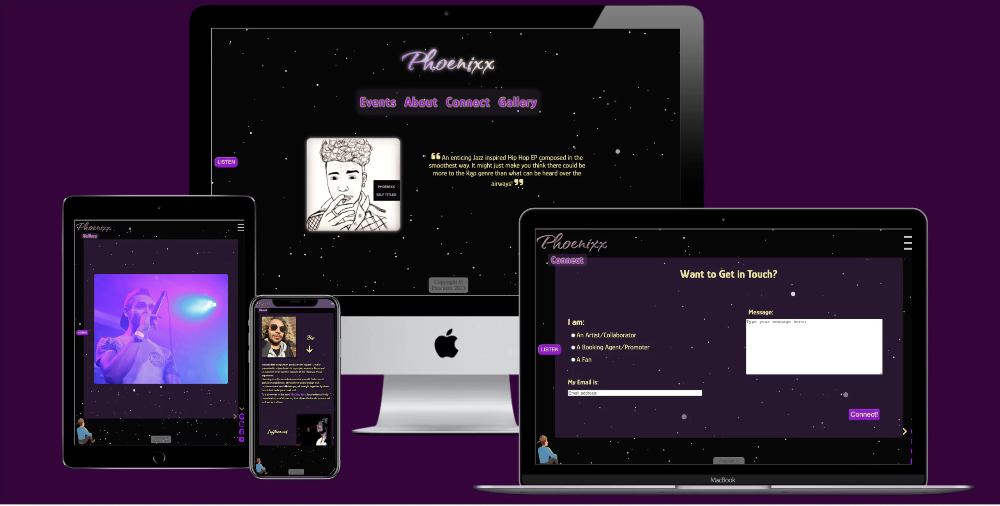

---

# User Experience (UX)
## Important Information to Include
- Links to streaming platforms
- Links to social media
- Tour dates and events
- Where to buy tickets
- A gallery devoted to the artist's highlights
## User Stories
### Client Goals
|Number|Goal|
|--|--|
|1.|As a client I want to be able to access and view the website on devices with different screen sizes. I know I am done when the site is accessible across multiple devices.|
|2.|As a client I want to ensure the appropriate information is readily available for fans or promoters that visit the website. I know I am done when all relevant information is correctly displayed for each section of the website.|
|3.|As a client I want to drive people towards Spotify, social media and events. I know I am done when the website provides external links, calls to action and subtle pointers towards the previous mentioned external links.|
|4.|As a client I want to provide a method of contact for bookings or other enquiries. I know I am done when the website provides a form for sending messages to the client/relevant channels.|
|5.|As a client I want to showcase media on the website. I know I am done when there is a functioning gallery section included on the website.|
|6.|As a client I want to stand out amongst others through creativity whilst not deterring/confusing visitors. I know I am done when the site is both interesting visually but also fully functional, with each call to action being fully descriptive and meaningful.| 
### First Time Visitor Goals
|Number|Goal|
|--|--|
|7.|As a first time visitor I want to find out who the artist is and what he does/what music he creates. I know I am done when the website provides links to music and socials as well as an "About" page.|
|8.|As a first time visitor I want to be able to navigate the site with ease. I know I am done when the links between sections of the website are easily understandable and displayed well.|
|9.|As a first time visitor I want to know about new events and see photos of past events. I know I am done when there is information provided about new events and a gallery to see photos of past events.|
|10.|As a first time visitor I want to I want to know where to listen to the artist's music. I know I am done when the website showcases external links to Spotify and YouTube.|
|11.|As a first time visitor I want to find links to social media so I can follow the artist.   I know I am done when the website directs visitors to social media links.| 
### Professional Visitor Goals
|Number|Goal|
|--|--|
|12.|As a professional visitor I want current information about the artist's upcoming shows and new releases. I know I am done when the website has a section that showcases upcoming events.|
|13.|As a professional visitor I want to find out more about the artist and what music he makes. I know I am done when the website provides links to music and socials as well as an "About" page.|
|14.|As a professional visitor I want to easily be able to contact the artist about potential shows or collaborations. I know I am done when the website provides a form for sending messages to the client/relevant channels.| 
### Fan Visitor Goals
|Number|Goal|
|--|--|
|15.|As a visiting fan I want to be able to find social media links easily. I know I am done when the site subtly directs visitors towards social media links.|
|16.|As a visiting fan I want to know more about the artist and find upcoming or recent events or releases. I know I am done when the website has a functioning events section.|
|--|--|

---
# Design
## Wireframes
Below I have provided the basic wireframes for the design of the website. I have also numbered each wireframe with the relevant User Story excluding number 1 as it applies to the entire website.
### Home
User Stories: 2, 3, 6, 7, 8, 10, 11, 13, 15
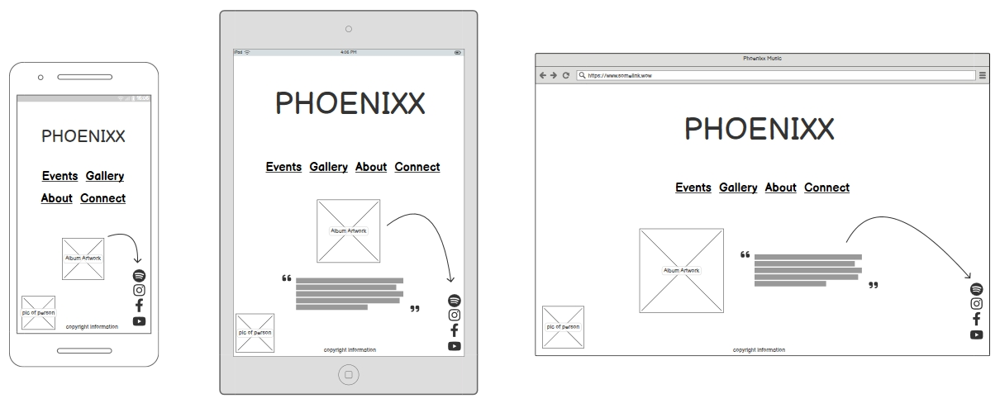
### Events
User Stories: 2, 9, 12, 16
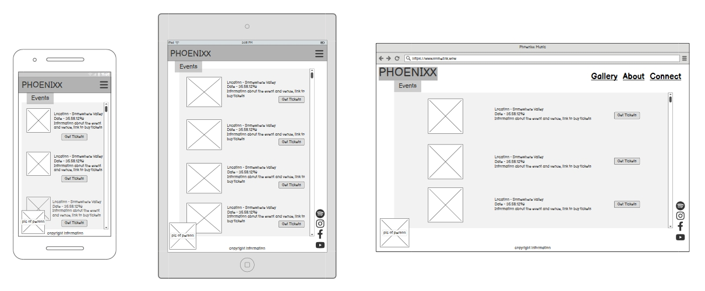
### Gallery
User Stories: 5, 7, 9
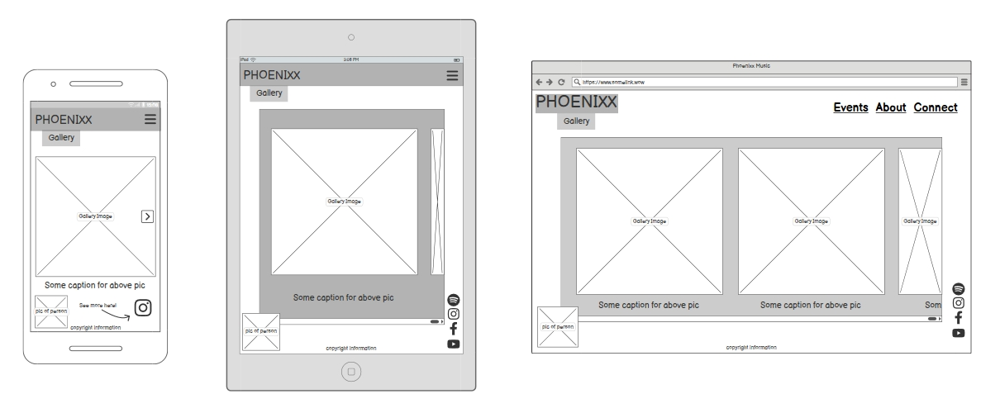
### About
User Stories: 2, 3, 5, 7, 13, 16 
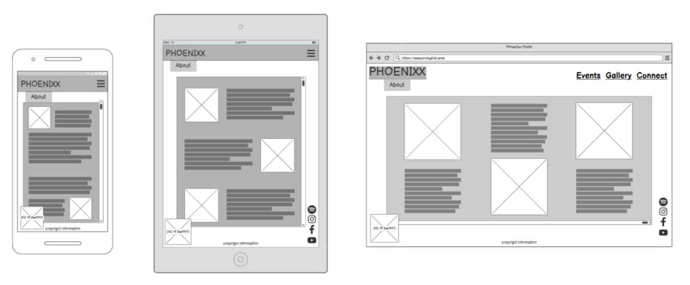
### Connect
2, 4, 14
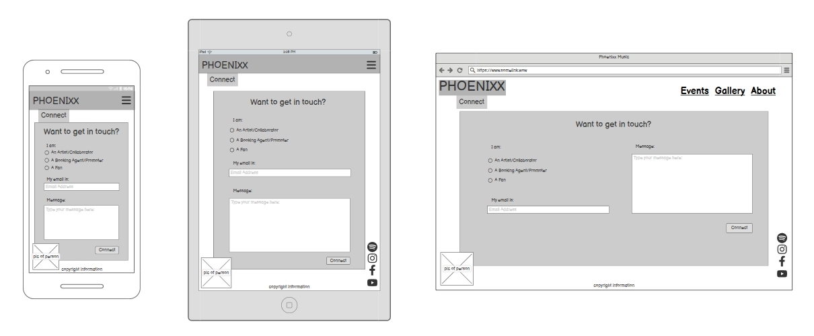
## Colour Palette
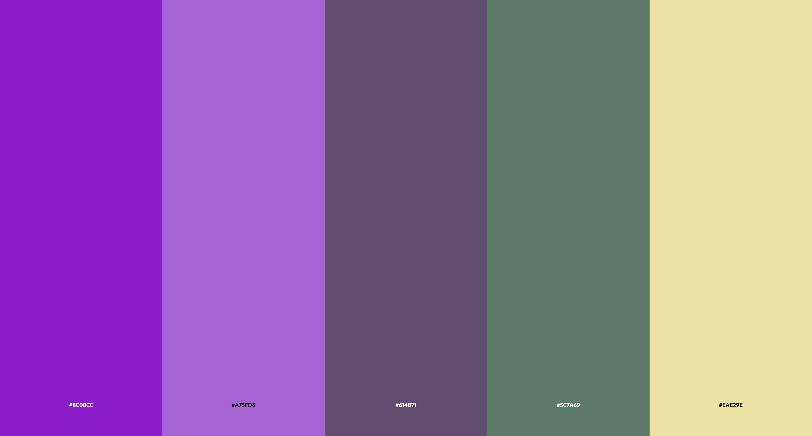

1. French Violet (Bold Dark Purple) - rgb(140, 0, 204)

2. Teldrassil Purple (Medium Pastel Purple) - rgb(167, 95, 214)

3. Gengiana (Muddy Dark Purple) - rgb(97, 75, 113)

4. Mt Burleigh (Dark Off Green) - rgb(92, 122, 105)

5. Citrino (Subtle Cream Highlighter) - rgb(234, 226, 158)

Throughout creating this website I have ensured that I switched my screen to greyscale. This has enabled me to keep my contrast interactions at a level which is accessible by mostly everybody as can be seen in the pictures below.

  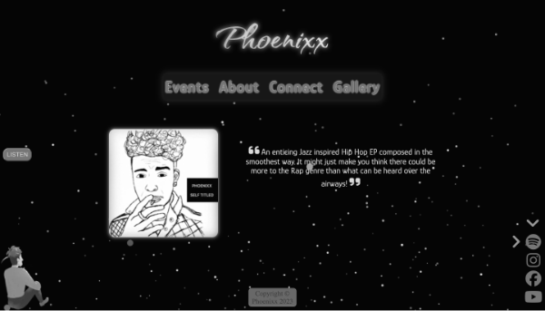
  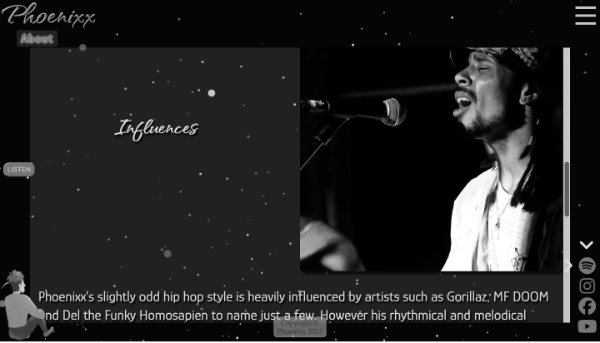
  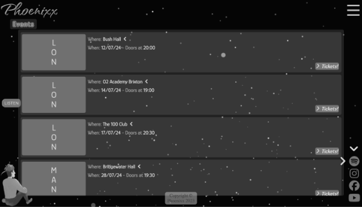
  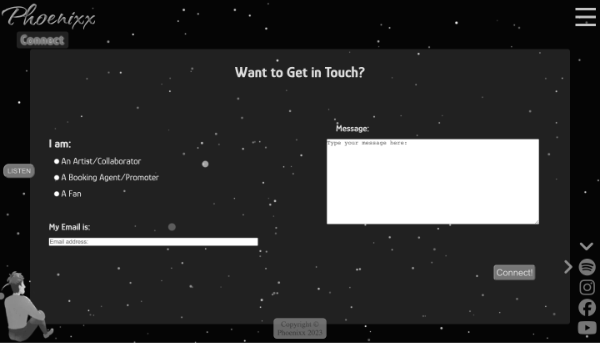
  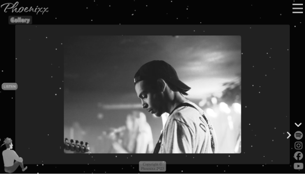

---

# Features

## Home Section

1. Starting with the background, on "DOM Content Loaded" an amount of particles is calculated using the screen width and height (to ensure that smaller devices deal with less physics calculations), created and then animated each frame. The reason for choosing this as a background refers back to [User Stories](#user-stories) number 6 - specifically, showing an artistic style that doesn't distract from the main focus of the website. 
2. The main title and navigation are center, clear and obvious.
3. The colours I chose for the title are a gradient between the light purple and yellow from the color palette.
  
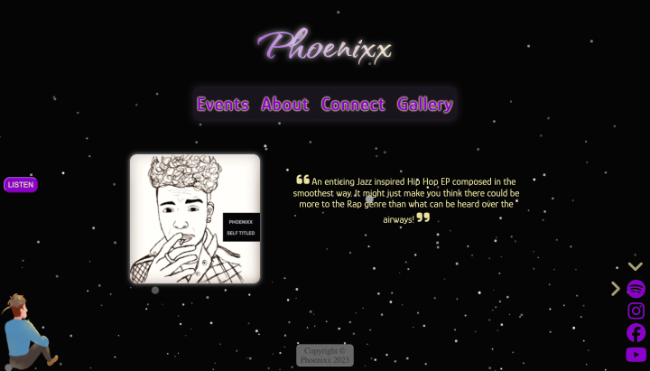

4. Underneath the navigation is a clickable image link which opens Phoenixx's EP on Spotify in a new tab.
5. Next to the image is a segment of a review that shows the visitor exactly who Phoenixx is and what sort of music he makes.
6. The idea of the gentleman in the bottom corner of the left side of the screen is that he sits and looks at the content with you. This ideally would have been a drawing/picture of Phoenixx but I am still to get a usable picture and so this is a free placeholder that I found online (link in [Resources](#resources)).
7. Copyright bottom-centre of the screen. As with the man, it stays concurrent throughout the entire site.
8. In the bottom right of the screen are some stylized social media links. To encourage the click I have also included animated chevrons that draw attention to the spotify link.

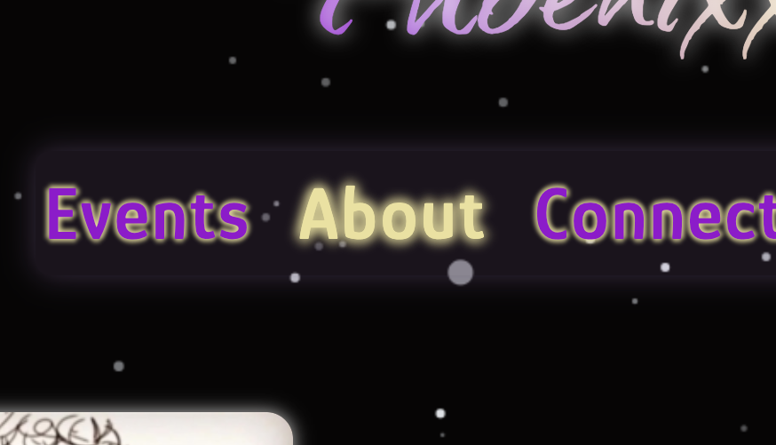

9. The navigation has a translucent purple background with purple writing over the top which encouraged my use of a yellow text-shadow to highlight and help make the contrast more obvious.
10. Each item in the navigation bar is big enough to draw attention and glow yellow when hovered over.

  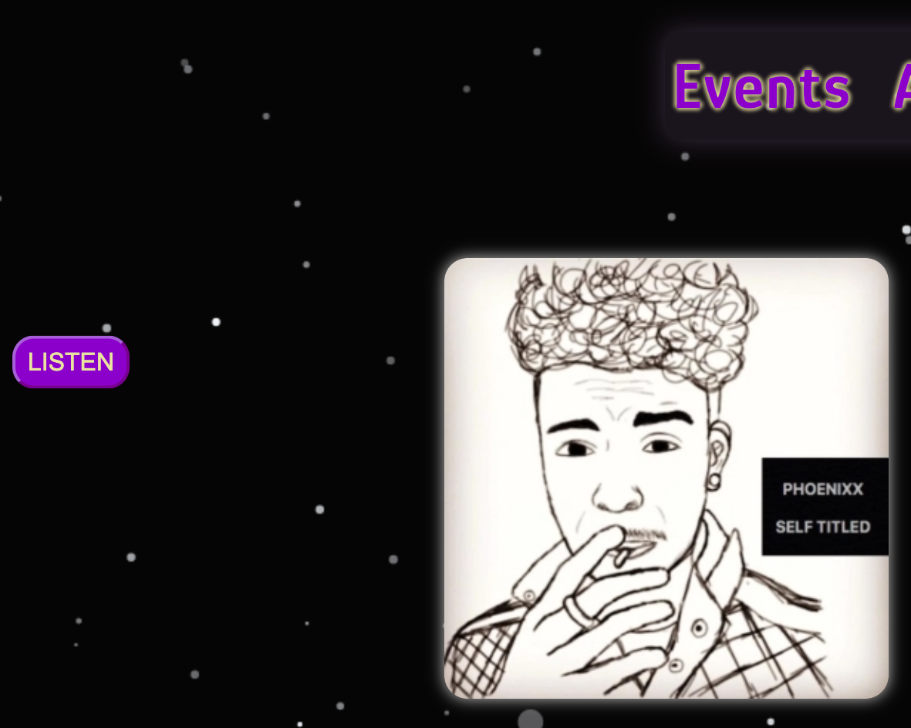
  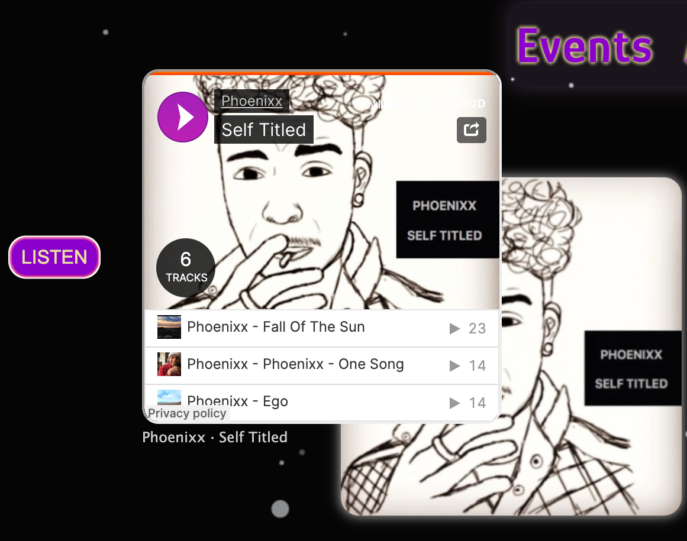

11. The final feature of the home screen is an embedded Soundcloud player, for the desktop version, that can be revealed by the "listen" button. Just like the little man at the bottom this button is concurrent. The idea is that you explore Phoenixx's music as you explore the website and get to know the artist.

## Events Section

1. The events section is a simple list of all upcoming shows, locations and times as well as a button that opens ticketmaster.
2. Each venue listed is a usable link that takes you to the appropriate venue's website.
3. Again, all links are marked by a chevron to draw attention and encourage users to click.

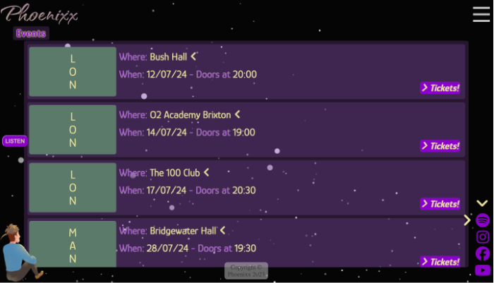

4. It is worth noting that instead of using headings, the navigation link becomes the heading and the rest are hidden behind a burger menu in the top right. The main title "Phoenixx" becoming the navigation link to return to the home section.

  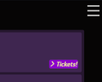
  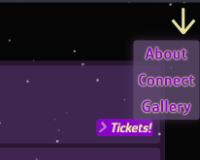

5. The above pictures show the interactivity of the burger menu when clicked.

## About Section

1. Each section apart from the "Home" section maintains a consistent style with content sitting atop a translucent purple card.
2. The About Section is split into three sections, designed to not be a simple "wall of text". A header containing a picture and a heading followed by a brief summary of each topic.
  

3. Within these paragraphs are links that direct the user to more of Phoenixx's work. Specifically the band he plays in and his Github.

## Connect Section

1. The connect section is a basic form to receive messages and (in the future) sort them into different inboxes for each of the three types of enquiries.
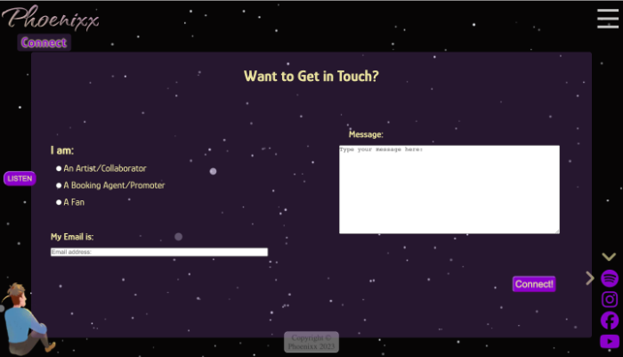

2. All three inputs must have valid input for the message to be sent.
3. Upon a successful form submission, there will be a pop up modal giving confirmation and the form will be cleared.

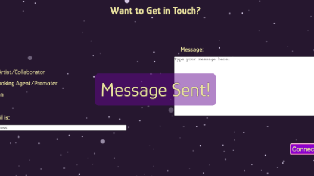

4. To improve feedback from interacting with the submit button the padding is animated as well as the borders to give it more of a three dimensional feel. 

  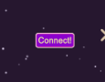
  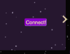

## Gallery Section

1. The gallery contains a collection of images, mainly from shows and events that Phoenixx has played.
2.  Each picture uses CSS's scroll-snap to center itself as the user scrolls by.

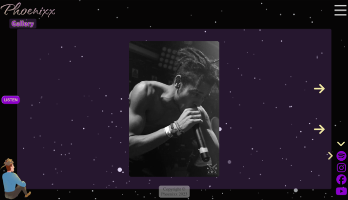

3. Although counterintuitive, scrolling downwards will scroll the gallery sideways. A stylistic choice that may be controversial but could be argued for in the case of this artist's website.
4. To help with the understanding of scrolling sideways there are animated arrows next to the first picture, preparing the user for the content stream to be presented horizontally.

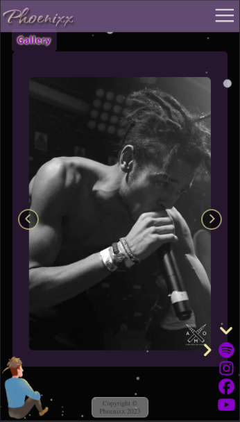

5. On mobile devices and smaller screens I have implemented a click through gallery with chevron icons that act as buttons to navigate the images.

*All sections of this website are accessed and loaded on one page using classes and javascript to hide inactive content.*

---

# Testing

## Validators

  - ### HTML
    - index.html - No errors were returned when passing through the official W3C validator.
    - https://validator.w3.org/nu/?doc=https%3A%2F%2Fphoenixxdevs.github.io%2FPhoenixx-pp1%2F

  - ### CSS
    - style.css - No errors were found when passing through the official jigsaw CSS validator.
    - https://jigsaw.w3.org/css-validator/validator?uri=https%3A%2F%2Fphoenixxdevs.github.io%2FPhoenixx-pp1%2Fassets%2Fcss%2Fstyle.css&profile=css3svg&usermedium=all&warning=1&vextwarning=&lang=en

## Testing User Stories

|Number|Result|Substantiation|
|--|--|--|
|1.|**_Complete_**|As a client I want to be able to access and view the website on devices with different screen sizes. I know I am done when the site is accessible across multiple devices. Evidence: The site can be used at [multiple screen sizes](#mock-ups).|
|2.|**_Complete_**|As a client I want to ensure the appropriate information is readily available for fans or promoters that visit the website. I know I am done when all relevant information is correctly displayed for each section of the website. Evidence: Each section of the website contains apporpriate information for both [fans](#events-section) (item 1) who may want to find events and [managers](#home-section) (items 5 & 11) who would be interested in what sort of music Phoenixx creates.|
|3.|**_Complete_**|As a client I want to drive people towards Spotify, social media and events. I know I am done when the website provides external links, calls to action and subtle pointers towards the previous mentioned external links.   Evidence: There are [links](#home-section) (item 8) throughout the website to direct traffic towards social media and music channels.|
|4.|**_Complete_**|As a client I want to provide a method of contact for bookings or other enquiries. I know I am done when the website provides a form for sending messages to the client/relevant channels.   Evidence: A complete "[Connect](#connect-section)" page for receiving message.|
|5.|**_Complete_**|As a client I want to showcase media on the website. I know I am done when there is a functioning gallery section included on the website.   Evidence: There is a fully functioning [Gallery](#gallery-section) containing pictures of the artist.|
|6.|**_Complete_**|As a client I want to stand out amongst others through creativity whilst not deterring/confusing visitors. I know I am done when the site is both interesting visually but also fully functional, with each call to action being fully descriptive and meaningful.  Evidence: The website has a unique [background animation](#home-section) (item 1) and stylised features such as the [burger menu](#events) (item 5).|
|7.|**_Complete_**|As a first time visitor I want to find out who the artist is and what he does/what music he creates. I know I am done when the website provides links to music and socials as well as an "About" page.   Evidence: There is links to both [socials](#home-section) (item 8) and an [About section](#about).|
|8.|**_Complete_**|As a first time visitor I want to be able to navigate the site with ease. I know I am done when the links between sections of the website are easily understandable and displayed well.  Evidence: This is achieved in the [Home Section](#home-section)(item 2) and the [responsive navigation](#events-section)(item 4).|
|9.|**_Complete_**|As a first time visitor I want to know about new events and see photos of past events. I know I am done when there is information provided about new events and a gallery to see photos of past events.  Evidence: There is both a fully functioning [Gallery](#gallery-section) and [Events section](#events-section).|
|10.|**_Complete_**|As a first time visitor I want to I want to know where to listen to the artist's music. I know I am done when the website showcases external links to Spotify and YouTube.  Evidence: There are [links](#home-section) (item 8) to Spotify and YouTube on most pages.|
|11.|**_Complete_**|As a first time visitor I want to find links to social media so I can follow the artist.   I know I am done when the website directs visitors to social media links.  Evidence: There are [links](#home-section) (item 8) to social media like Facebook and Instagram| 
|12.|**_Complete_**|As a professional visitor I want current information about the artist's upcoming shows and new releases. I know I am done when the website has a section that showcases upcoming events.   Evidence: There is a fully functioning [Events](#events-section) that leads to venue and ticket websites.|
|13.|**_Complete_**|As a professional visitor I want to find out more about the artist and what music he makes. I know I am done when the website provides links to music and socials as well as an "About" page.|
|14.|**_Complete_**|As a professional visitor I want to easily be able to contact the artist about potential shows or collaborations. I know I am done when the website provides a form for sending messages to the client/relevant channels.  The [Connect section](#connect-section) allows anybody to make an inquiry.| 
|15.|**_Complete_**|As a visiting fan I want to be able to find social media links easily. I know I am done when the site subtly directs visitors towards social media links.  Evidence: [Home Section](#home-section) (item 8) is the perfect example of drawing attention to links.|
|16.|**_Complete_**|As a visiting fan I want to know more about the artist and find upcoming or recent events or releases. I know I am done when the website has a functioning events section.  Evidence: The artist has a functioning [Events](#events-section) page that displays all of the relevant information.|  

# Resources
## Images
Image of man in bottom left - https://pngtree.com/freepng/cartoon-style-man-sitting-on-his-back_4288845.html
## Utilities
|Used For|Link|
|--|--|
|Markdown Editor|https://stackedit.io/app#|
|VSCode Markdown|https://github.com/yzhang-gh/vscode-markdown|
|Colour Palette Design|https://color.adobe.com/My-Color-Theme-color-theme-889ac981-1580-4518-8afb-66671f0c0db8|
|Choosing colours|https://careerfoundry.com/en/blog/ui-design/introduction-to-color-theory-and-color-palettes/|
|Gradient Text|https://cssgradient.io/blog/css-gradient-text/|
|Burger Menu in CSS|https://www.w3schools.com/howto/howto_css_menu_icon.asp|
|Cloning Element for Burger Menu|https://gomakethings.com/how-to-copy-or-clone-an-element-with-vanilla-js/#:~:text=You%20call%20the%20cloneNode(),of%20it%20var%20clone%20%3D%20elem.|
|Text Rotation in CSS|https://www.turing.com/kb/how-to-rotate-text-in-css|
|Breakpoint Locations|https://www.freecodecamp.org/news/the-100-correct-way-to-do-css-breakpoints-88d6a5ba1862/|
|Horizontal Scroll in JS|https://dev.to/samthor/divert-vertical-scroll-to-the-side-3id0#:~:text=Vertical%20To%20Horizontal&text=We%20can%20actually%20redirect%20catch,we%20prevent%20real%20horizontal%20scrolling.|
|Lazy Loading Images|https://web.dev/articles/lazy-loading-images|
|[About Section](#about) Container Horizontal Scrolling|https://alvarotrigo.com/blog/scroll-horizontally-with-mouse-wheel-vanilla-java/|
|[About Section](#about) Container Scroll Snapping|https://alvarotrigo.com/blog/css-snap-scroll-horizontally/|
|[Home Section](#home) Responsive CSS Arrow|https://codepen.io/pamcy/pen/wQbEao?editors=1100|